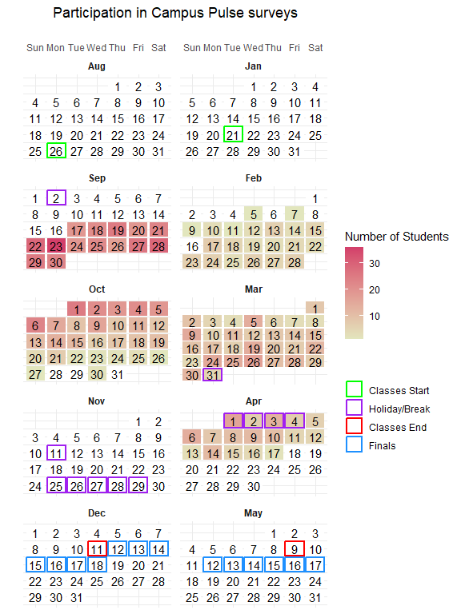
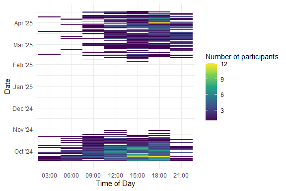
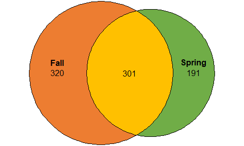
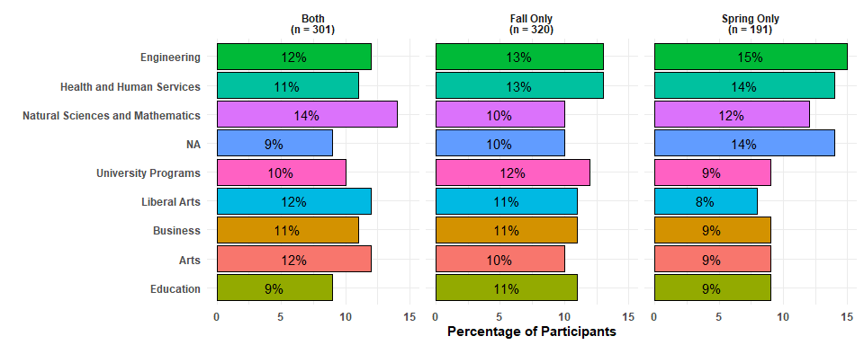
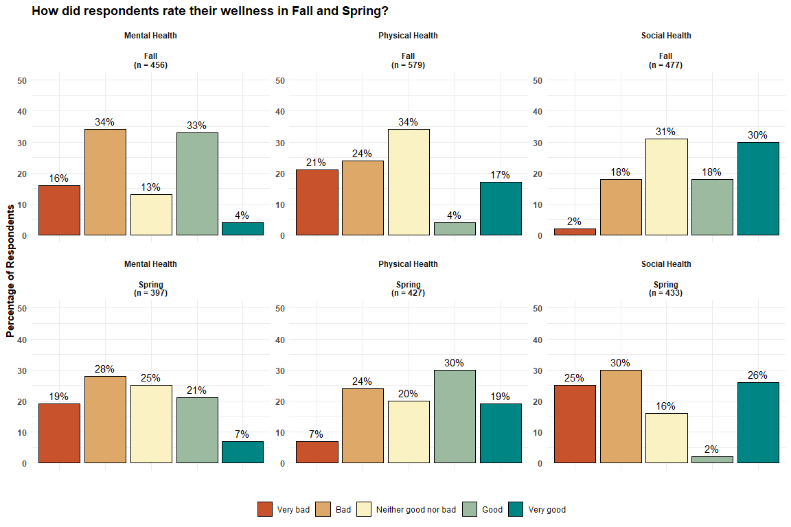
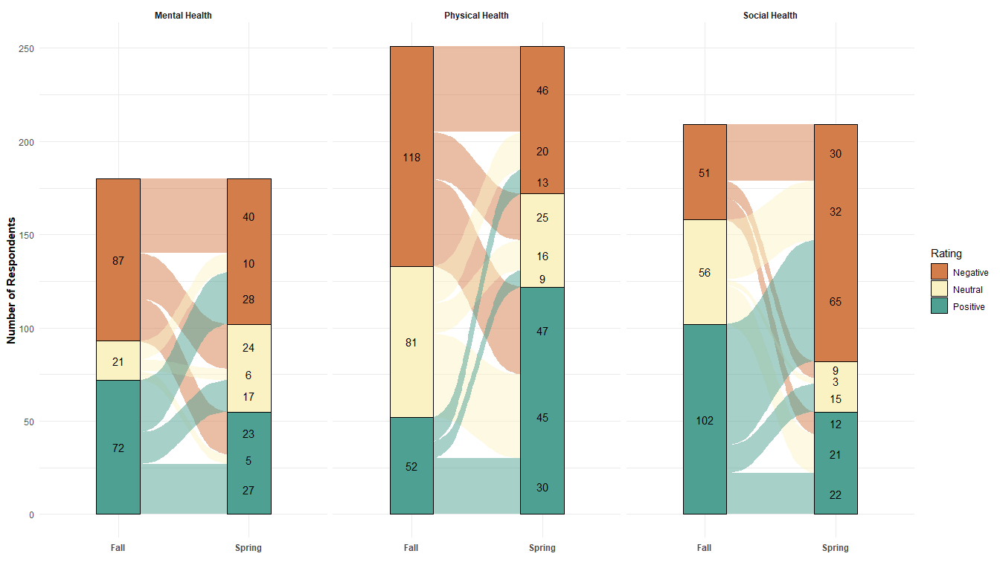
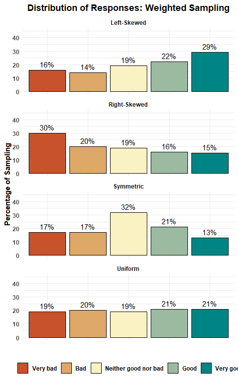
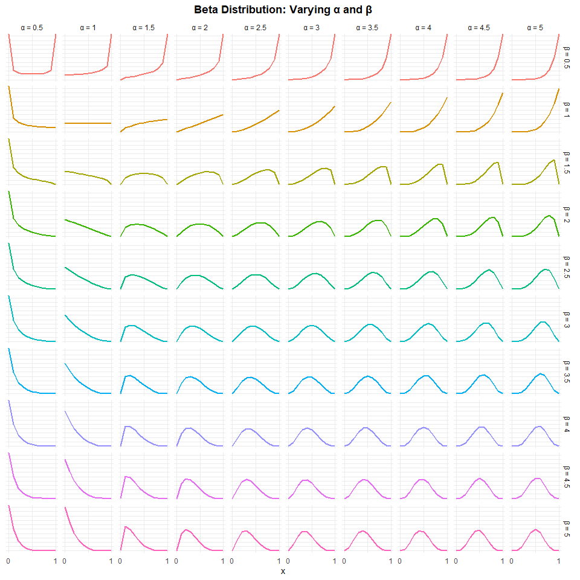
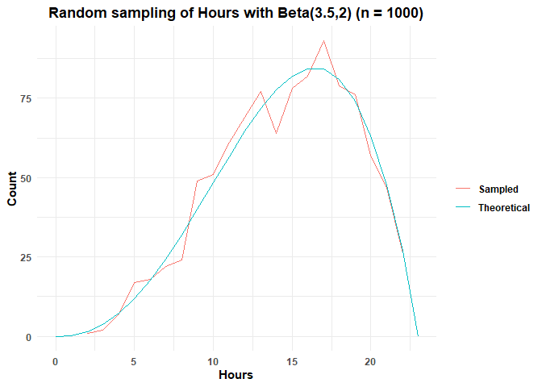

Visualizing survey data with tidyverse
================

- [**Introduction**](#introduction)
- [**Packages**](#packages)
- [**Data sets**](#data-sets)
- [**Visuals**](#visuals)
  - [**Survey start dates (Heat map)**](#survey-start-dates-heat-map)
  - [**Survey start times (Heat map)**](#survey-start-times-heat-map)
  - [**Survey participation (Venn
    diagram)**](#survey-participation-venn-diagram)
  - [**Survey participation (Bar
    plot)**](#survey-participation-bar-plot)
  - [**Distribution of responses (Bar
    plot)**](#distribution-of-responses-bar-plot)
  - [**Tracking responses (Alluvial
    diagrams)**](#tracking-responses-alluvial-diagrams)
- [**Background**](#background)
  - [**Sampling Techniques**](#sampling-techniques)
    - [**Likert Responses**](#likert-responses)
    - [**Time and Date**](#time-and-date)

### **Introduction**

This is a demonstration that showcases some methods for visualizing
survey data. Here, we consider data from a survey that was administered
at two time points (Fall 2024 and Spring 2025) to the same student
population. We are primarily interested in survey participation rates
and distribution of responses.

Note that all data presented here is fictitious. See
[**Background**](#background) for how the data was created.

### **Packages**

We will be using these packages:

``` r
library(tidyverse)
library(paletteer)
library(skimr)
library(eulerr)
library(ggalluvial)
library(knitr)
```

### **Data sets**

**Fall Survey**

``` r
df24 %>% head()
```

    ##     user_id             college       start_date mental_health      physical_health        social_health
    ## 726     726 University Programs 2024-09-24 21:53          Good                  Bad                  Bad
    ## 890     890 University Programs 2024-10-14 11:08          Good Neither good nor bad Neither good nor bad
    ## 950     950 University Programs 2024-10-30 19:38           Bad Neither good nor bad             Very bad
    ## 187     187                Arts 2024-10-14 11:28           Bad             Very bad Neither good nor bad
    ## 470     470            Business 2024-10-18 12:40          <NA>             Very bad                 <NA>
    ## 688     688 University Programs 2024-10-09 18:58          Good Neither good nor bad Neither good nor bad

``` r
df24 %>% skim()
```

|                                                  |            |
|:-------------------------------------------------|:-----------|
| Name                                             | Piped data |
| Number of rows                                   | 621        |
| Number of columns                                | 6          |
| \_\_\_\_\_\_\_\_\_\_\_\_\_\_\_\_\_\_\_\_\_\_\_   |            |
| Column type frequency:                           |            |
| character                                        | 5          |
| numeric                                          | 1          |
| \_\_\_\_\_\_\_\_\_\_\_\_\_\_\_\_\_\_\_\_\_\_\_\_ |            |
| Group variables                                  | None       |

Data summary

**Variable type: character**

| skim_variable   | n_missing | complete_rate | min | max | empty | n_unique | whitespace |
|:----------------|----------:|--------------:|----:|----:|------:|---------:|-----------:|
| college         |        63 |          0.90 |   4 |  32 |     0 |        8 |          0 |
| start_date      |         0 |          1.00 |  16 |  16 |     0 |      615 |          0 |
| mental_health   |       165 |          0.73 |   3 |  20 |     0 |        5 |          0 |
| physical_health |        42 |          0.93 |   3 |  20 |     0 |        5 |          0 |
| social_health   |       144 |          0.77 |   3 |  20 |     0 |        5 |          0 |

**Variable type: numeric**

| skim_variable | n_missing | complete_rate |   mean |     sd |  p0 | p25 | p50 | p75 | p100 | hist  |
|:--------------|----------:|--------------:|-------:|-------:|----:|----:|----:|----:|-----:|:------|
| user_id       |         0 |             1 | 502.12 | 289.08 |   1 | 259 | 503 | 748 |  999 | ▇▇▇▇▇ |

**Spring Survey**

``` r
df25 %>% head()
```

    ##     user_id                          college       start_date        mental_health physical_health social_health
    ## 687     687                         Business 2025-03-01 19:12                  Bad       Very good           Bad
    ## 165     165              University Programs 2025-04-03 19:38 Neither good nor bad            <NA>     Very good
    ## 354     354                        Education 2025-04-10 19:14                  Bad            Good           Bad
    ## 393     393 Natural Sciences and Mathematics 2025-04-04 14:33             Very bad             Bad           Bad
    ## 302     302        Health and Human Services 2025-03-30 13:13 Neither good nor bad             Bad     Very good
    ## 307     307 Natural Sciences and Mathematics 2025-04-10 14:35 Neither good nor bad             Bad           Bad

``` r
df25 %>% skim()
```

|                                                  |            |
|:-------------------------------------------------|:-----------|
| Name                                             | Piped data |
| Number of rows                                   | 492        |
| Number of columns                                | 6          |
| \_\_\_\_\_\_\_\_\_\_\_\_\_\_\_\_\_\_\_\_\_\_\_   |            |
| Column type frequency:                           |            |
| character                                        | 5          |
| numeric                                          | 1          |
| \_\_\_\_\_\_\_\_\_\_\_\_\_\_\_\_\_\_\_\_\_\_\_\_ |            |
| Group variables                                  | None       |

Data summary

**Variable type: character**

| skim_variable   | n_missing | complete_rate | min | max | empty | n_unique | whitespace |
|:----------------|----------:|--------------:|----:|----:|------:|---------:|-----------:|
| college         |        54 |          0.89 |   4 |  32 |     0 |        8 |          0 |
| start_date      |         0 |          1.00 |  16 |  16 |     0 |      489 |          0 |
| mental_health   |        95 |          0.81 |   3 |  20 |     0 |        5 |          0 |
| physical_health |        65 |          0.87 |   3 |  20 |     0 |        5 |          0 |
| social_health   |        59 |          0.88 |   3 |  20 |     0 |        5 |          0 |

**Variable type: numeric**

| skim_variable | n_missing | complete_rate | mean | sd | p0 | p25 | p50 | p75 | p100 | hist |
|:---|---:|---:|---:|---:|---:|---:|---:|---:|---:|:---|
| user_id | 0 | 1 | 500.2 | 288.81 | 1 | 254.75 | 488.5 | 749.25 | 999 | ▇▇▇▇▇ |

### **Visuals**

#### **Survey start dates (Heat map)**

Using the CSULB academic calendar for 2024-2025, we visualize start
dates:

``` r
ref_dates <- read_csv("csulb_2425_calendar.csv",show_col_types = FALSE)
ref_dates <- ref_dates %>% 
  mutate(Date = dmy(Date))

df_startDates <- df24 %>% 
  bind_rows(df25)

dates_heatmap <- df_startDates %>% 
  select(`Start Date`) %>% 
  separate_wider_delim(cols = `Start Date`,delim = " ",names = c("Date","Time")) %>% 
  select(Date) %>% 
  table() %>% 
  as.data.frame() %>% 
  mutate(Date = ymd(Date)) %>% 
  complete(Date = seq(as.Date("2024-07-28"),as.Date("2025-05-31"),by = "day")) %>% 
  mutate(month = month(Date,label = TRUE),
         wday = wday(Date,label = TRUE),
         day = day(Date),
         week = as.integer(
           ((Date - min(Date)) / 7) + 1
         ),
         month = factor(month,levels = c("Aug","Sep","Oct","Nov","Dec","Jan","Feb","Mar","Apr","May"))
  ) %>% 
  filter(!is.na(month))

dates_heatmap <- dates_heatmap %>% 
  left_join(ref_dates,by = join_by(Date)) %>% 
  mutate(Event = factor(Event,levels = c("Classes Start","Holiday/Break","Classes End","Finals")),
         "Term" = case_when(
           month %in% c("Aug","Sep","Oct","Nov","Dec") ~ "Fall",
           month %in% c("Jan","Feb","Mar","Apr","May") ~ "Spring"
  ))

ggplot(dates_heatmap,aes(x = wday,y = week)) + 
  geom_tile(aes(fill = Freq,color = Event,width = 0.9,height = 0.9),linewidth = 1) + # Set width and height for complete border
  geom_text(aes(label = day)) + 
  theme_minimal() + 
  facet_wrap(~month,scales = "free_y",ncol = 2,dir = "v") + 
  scale_fill_gradient(low = "#E2E6BD",high = "#D33F6A",na.value = "white") + 
  scale_color_manual(values = c("Holiday/Break" = "purple","Classes Start" = "green",
                                "Finals" = "dodgerblue","Classes End" = "red"),
                     na.value = "white", # Border around NA values is white
                     na.translate = FALSE) + # Removes NA from legend
  scale_x_discrete(position = "top") + 
  scale_y_continuous(transform = "reverse") + 
  theme(axis.text.y = element_blank(),
        plot.title = element_text(hjust = 0.5),
        strip.text = element_text(face = "bold")) + 
  labs(title = "Participation in Campus Pulse surveys", x = "", y = "",
       fill = "Number of Students",color = "") + 
  guides(color = guide_legend(override.aes = list(fill = "white"))) # Changes fill of color legend to white
```



#### **Survey start times (Heat map)**

We also visualize start times:

``` r
df_startDates %>% 
  select(`Start Date`) %>% 
  separate_wider_delim(cols = `Start Date`,delim = " ",names = c("Date","Time")) %>% 
  mutate(Date = ymd(Date),
         Time = as.numeric(gsub(":","",Time)),
         dummyTime = cut(Time,breaks = c(0,300,600,900,1200,1500,1800,2100,2400))) %>% 
  count(dummyTime,Date) %>% 
  ggplot(aes(x = dummyTime,y = Date, fill = n)) + 
  geom_tile() + 
  theme_minimal() + 
  scale_fill_viridis_c() + 
  labs(x = "Time of Day","Date",fill = "Number of participants") + 
  theme(legend.position = "right") + 
  scale_y_date(date_breaks = "1 month",date_labels = "%b '%y") + 
  scale_x_discrete(labels = c("03:00","06:00","09:00","12:00","15:00","18:00","21:00","00:00"))
```



#### **Survey participation (Venn diagram)**

For this data, we are working with the idea that the Fall and Spring
surveys had different participation rates. The same population was
surveyed at both time points but only a select proportion of students
participated in both surveys; additionally, some students participated
in only Fall and only Spring. We can visualize this with a venn diagram:

``` r
dfBoth <- df25 %>% 
  inner_join(df24,by = join_by(`User Id`)) %>% 
  rename_with(~ gsub(pattern = ".x",replacement = " S25",.x,fixed = TRUE)) %>% # See dplyr::rename vignette
  rename_with(~ gsub(pattern = ".y",replacement = " F24",.x,fixed = TRUE))

vd.counts<-c("Fall" = df24 %>% anti_join(dfBoth,by = join_by(`User Id`)) %>% nrow(),
             "Spring" = df25 %>% anti_join(dfBoth,by = join_by(`User Id`)) %>% nrow(),
             "Fall&Spring" = dfBoth %>% nrow())
plot(
  euler(vd.counts),
  quantities = TRUE,
  fills = c("#ED7D31","#70AD47","#FFC000")
)
```



#### **Survey participation (Bar plot)**

It is very common to examine a subsetted population by a specific
category. Let’s visualize survey participation by college:

``` r
bind_rows(
  df24 %>% 
    anti_join(dfBoth,by = join_by(`User Id`)) %>% 
    count(College) %>% 
    mutate("Term" = "Fall Only"),
  df25 %>% 
    anti_join(dfBoth,by = join_by(`User Id`)) %>% 
    count(College) %>% 
    mutate("Term" = "Spring Only"),
  dfBoth %>% 
    count(`College S25`) %>% 
    rename("College" = `College S25`) %>% 
    mutate("Term" = "Both")
) %>% 
  mutate(
    College = case_when(
      is.na(College) ~ "NA",
      TRUE ~ College
    ),
    Term = factor(Term,levels = c("Fall Only","Spring Only","Both"))) %>% 
  group_by(Term) %>% 
  mutate("Proportion" = round(n*100/sum(n)),
         "TermAndLabel" = paste(
           Term,
           paste0("(n = ",sum(n),")"),
           sep = "\n")) %>% 
  ggplot(aes(x = Proportion,y = reorder(College,Proportion),fill = College)) + 
  geom_col(color = "black") + 
  facet_wrap(~TermAndLabel,nrow = 1) + 
  geom_text(aes(label = paste0(Proportion,"%")),
            position = position_stack(vjust = 0.5)) + 
  theme_minimal() + 
  theme(legend.position = "none",
        plot.title = element_text(face = "bold",hjust = 0.5),
        axis.title = element_text(face = "bold"),
        axis.text = element_text(face = "bold"),
        strip.text = element_text(face = "bold")) +  
  labs(x = "Percentage of Participants",y = "")
```



#### **Distribution of responses (Bar plot)**

Now we look at the actual survey responses. How did respondents rate
their wellness? For this, we ignore missing responses to questions and
use the following method.

Suppose:

- Survey has 100 participants
- Question 1 has responses: A,B
- 90 participants respond to Question 1
- 70 respond A, 20 respond B
- Then, A is: 78% (70/90) and B is: 22% (20/90)

<!-- -->

#### **Tracking responses (Alluvial diagrams)**

Can we see how responses changed between surveys? We know that we have a
handful of students who participated in both surveys; for those who are
respondents, we can track how wellness improved, worsened, or stayed the
same.

Merging responses:

- Negative: Very bad, Bad
- Neutral: Neither good nor bad
- Positive: Good, Very good

``` r
dfBoth <- dfBoth %>% 
  mutate(
    "mental_coded_char_F24" = case_when(
      `Mental Health F24` == "Very good" ~ "Positive",
      `Mental Health F24` == "Good" ~ "Positive",
      `Mental Health F24` == "Neither good nor bad" ~ "Neutral",
      `Mental Health F24` == "Bad" ~ "Negative",
      `Mental Health F24` == "Very bad" ~ "Negative",
      TRUE ~ NA
    ),
    "physical_coded_char_F24" = case_when(
      `Physical Health F24` == "Very good" ~ "Positive",
      `Physical Health F24` == "Good" ~ "Positive",
      `Physical Health F24` == "Neither good nor bad" ~ "Neutral",
      `Physical Health F24` == "Bad" ~ "Negative",
      `Physical Health F24` == "Very bad" ~ "Negative",
      TRUE ~ NA
    ),
    "social_coded_char_F24" = case_when(
      `Social Health F24` == "Very good" ~ "Positive",
      `Social Health F24` == "Good" ~ "Positive",
      `Social Health F24` == "Neither good nor bad" ~ "Neutral",
      `Social Health F24` == "Bad" ~ "Negative",
      `Social Health F24` == "Very bad" ~ "Negative",
      TRUE ~ NA
    ),
    "mental_coded_char_S25" = case_when(
      `Mental Health S25` == "Very good" ~ "Positive",
      `Mental Health S25` == "Good" ~ "Positive",
      `Mental Health S25` == "Neither good nor bad" ~ "Neutral",
      `Mental Health S25` == "Bad" ~ "Negative",
      `Mental Health S25` == "Very bad" ~ "Negative",
      TRUE ~ NA
    ),
    "physical_coded_char_S25" = case_when(
      `Physical Health S25` == "Very good" ~ "Positive",
      `Physical Health S25` == "Good" ~ "Positive",
      `Physical Health S25` == "Neither good nor bad" ~ "Neutral",
      `Physical Health S25` == "Bad" ~ "Negative",
      `Physical Health S25` == "Very bad" ~ "Negative",
      TRUE ~ NA
    ),
    "social_coded_char_S25" = case_when(
      `Social Health S25` == "Very good" ~ "Positive",
      `Social Health S25` == "Good" ~ "Positive",
      `Social Health S25` == "Neither good nor bad" ~ "Neutral",
      `Social Health S25` == "Bad" ~ "Negative",
      `Social Health S25` == "Very bad" ~ "Negative",
      TRUE ~ NA
    )
  )

likert.order.3.color<-c("#D37D4AFF","#FBF2C4FF","#4EA093FF")

bind_rows(
  dfBoth %>% 
    filter(!is.na(mental_coded_char_F24) & !is.na(mental_coded_char_S25)) %>% 
    select(`User Id`,mental_coded_char_F24,mental_coded_char_S25) %>% 
    rename("Fall" = mental_coded_char_F24,"Spring" = mental_coded_char_S25) %>% 
    pivot_longer(cols = !`User Id`,names_to = "Term",values_to = "Rating") %>% 
    mutate(Question = "Mental Health"),
  dfBoth %>% 
    filter(!is.na(physical_coded_char_F24) & !is.na(physical_coded_char_S25)) %>% 
    select(`User Id`,physical_coded_char_F24,physical_coded_char_S25) %>% 
    rename("Fall" = physical_coded_char_F24,"Spring" = physical_coded_char_S25) %>% 
    pivot_longer(cols = !`User Id`,names_to = "Term",values_to = "Rating") %>% 
    mutate(Question = "Physical Health"),
  dfBoth %>% 
    filter(!is.na(social_coded_char_F24) & !is.na(social_coded_char_S25)) %>% 
    select(`User Id`,social_coded_char_F24,social_coded_char_S25) %>% 
    rename("Fall" = social_coded_char_F24,"Spring" = social_coded_char_S25) %>% 
    pivot_longer(cols = !`User Id`,names_to = "Term",values_to = "Rating") %>% 
    mutate(Question = "Social Health")
) %>% 
  mutate(Question = factor(Question,levels = c("Mental Health","Physical Health","Social Health"))) %>% 
  ggplot(aes(x = Term,alluvium = `User Id`,stratum = Rating)) + 
  geom_flow(aes(fill = Rating)) + 
  geom_stratum(aes(fill = Rating)) + 
  theme_minimal() + 
  facet_wrap(~Question,nrow = 1) + 
  scale_fill_manual(values = likert.order.3.color) + 
  geom_text(stat = "flow",aes(label = ifelse(after_stat(x == 2),
                                             after_stat(count),
                                             NA))) + 
  geom_text(stat = "stratum",aes(label = ifelse(after_stat(x == 1),
                                                after_stat(count),
                                                NA))) + 
  labs(x = "",y = "Number of Respondents") + 
  theme(legend.position = "right",
        plot.title = element_text(face = "bold",hjust = 0.5),
        axis.text.x = element_text(face = "bold"),
        axis.title.y = element_text(face = "bold"),
        strip.text = element_text(face = "bold"))
```

<!-- -->

We see that survey results offer a lot of insight! Here, we explored
only a few of many visualization techniques.

### **Background**

This is a brief behind-the-scenes look on how the data in this
demonstration was created.

#### **Sampling Techniques**

##### **Likert Responses**

Typical values of the Likert scale are:

- Very Bad
- Bad
- Neither good nor bad
- Good
- Very good

To create a dataset with these values, we need to randomly select and
distribute the responses.

Because pure random sampling will distribute our responses uniformly, we
specify weights so that we may obtain non-uniform distributions.

``` r
likertWellness <- c("Very bad","Bad","Neither good nor bad","Good","Very good")
smp.prob <- c(0.15,0.20,0.30,0.20,0.15)

set.seed(377)
bind_rows(
  sample(x = likertWellness,size = 500,replace = TRUE,
         prob = sort(smp.prob,decreasing = FALSE)) %>% # ascending
    as.data.frame() %>% 
    rename("Response" = ".") %>% 
    count(Response) %>% 
    mutate(Proportion = round(n*100/sum(n)),
           Distribution = "Left-Skewed"),
  sample(x = likertWellness,size = 500,replace = TRUE,
         prob = sort(smp.prob,decreasing = TRUE)) %>% # descending
    as.data.frame() %>% 
    rename("Response" = ".") %>% 
    count(Response) %>% 
    mutate(Proportion = round(n*100/sum(n)),
           Distribution = "Right-Skewed"),
  sample(x = likertWellness,size = 500,replace = TRUE,
         prob = smp.prob) %>% # symmetric
    as.data.frame() %>% 
    rename("Response" = ".") %>% 
    count(Response) %>% 
    mutate(Proportion = round(n*100/sum(n)),
           Distribution = "Symmetric"),
  sample(x = likertWellness,size = 500,replace = TRUE) %>% # uniform
    as.data.frame() %>% 
    rename("Response" = ".") %>% 
    count(Response) %>% 
    mutate(Proportion = round(n*100/sum(n)),
           Distribution = "Uniform")
  ) %>% 
  mutate(Response = factor(Response,levels = likertWellness)) %>% 
  ggplot(aes(x = Response,y = Proportion,fill = Response)) + 
  geom_col(color = "black") + 
  geom_text(aes(label = paste0(Proportion,"%"),vjust = -0.5)) + 
  facet_wrap(~Distribution,ncol = 1) + 
  theme_minimal() + 
  scale_fill_manual(values = rev(paletteer_c("grDevices::Geyser",length(likertWellness)))) + 
  scale_y_continuous(limits = c(0,45)) + 
  labs(x = "",y = "Percentage of Sampling",fill = "",
       title = "Distribution of Responses: Weighted Sampling") + 
  theme(plot.title = element_text(face = "bold",hjust = 0.5),
        axis.text.x = element_blank(),
        axis.title.y = element_text(face = "bold"),
        axis.text.y = element_text(face = "bold"),
        strip.text = element_text(face = "bold"),
        legend.text = element_text(face = "bold"),
        legend.position = "bottom")
```



##### **Time and Date**

We are also working with time and date data. These values take on a
larger range than our Likert values.

| Variable | Value      |
|:---------|:-----------|
| Hours    | 0 to 23    |
| Minutes  | 0 to 59    |
| Months   | 1 to 12    |
| Days     | 1 to 28-31 |

We are working with more values here so it’s not as practical to specify
individual probabilities like earlier. A feasible alternative is to
assign probabilities with a probability distribution.

Consider the beta distribution with shape parameters **α** and **β**.

``` r
alpha.in <- seq(0.5,5,by = 0.5)
beta.in <- seq(0.5,5,by = 0.5)
x_vals <- seq(0,1,by = 0.1)

expand_grid(x = x_vals,
            alpha = alpha.in,
            beta = beta.in) %>% 
  mutate(Density = dbeta(x = x,shape1 = alpha,shape2 = beta),
         alphaParam = paste0("α = ",alpha),
         betaParam = paste0("β = ",beta)) %>% 
  ggplot(aes(x = x,y = Density,color = betaParam)) + 
  geom_line(linewidth = 0.9) + 
  facet_grid(betaParam~alphaParam) + 
  theme_minimal() + 
  scale_x_continuous(breaks = range(x_vals)) + 
  labs(title = "Beta Distribution: Varying α and β") + 
  theme(axis.title.y = element_blank(),
        axis.text.y = element_blank(),
        plot.title = element_text(face = "bold",hjust = 0.5),
        legend.position = "none")
```



The beta distribution is defined for a random variable on the interval
\[0,1\]. We subjectively select the best shape to fit our variable to;
let’s select **α = 3.5** and **β = 2** for modeling hours in a day.

``` r
timeHours <- 0:23

# Normalize our range of values to fit into the defined [0,1] interval.
x.norm <- (timeHours - min(timeHours)) / (max(timeHours) - min(timeHours))
print(x.norm)
```

    ##  [1] 0.00000000 0.04347826 0.08695652 0.13043478 0.17391304 0.21739130 0.26086957 0.30434783 0.34782609 0.39130435 0.43478261 0.47826087 0.52173913 0.56521739 0.60869565 0.65217391 0.69565217
    ## [18] 0.73913043 0.78260870 0.82608696 0.86956522 0.91304348 0.95652174 1.00000000

``` r
# Now get density values for our x-values:
density_vals <- dbeta(x.norm, shape1 = 3.5, shape2 = 2)
print(density_vals)
```

    ##  [1] 0.000000000 0.005938214 0.032064717 0.084152353 0.164110629 0.271600552 0.404631957 0.559884204 0.732907825 0.918263753 1.109625643 1.299858538 1.481081415 1.644718255 1.781540627 1.881703821
    ## [17] 1.934777948 1.929775045 1.855172932 1.698936418 1.448536276 1.090966373 0.612759191 0.000000000

``` r
# We can now get probabilities:
prob_vals <- density_vals/sum(density_vals)
print(prob_vals)
```

    ##  [1] 0.0000000000 0.0002588246 0.0013975813 0.0036678869 0.0071529696 0.0118380540 0.0176363962 0.0244032620 0.0319447157 0.0400236885 0.0483644388 0.0566559804 0.0645548090 0.0716871279 0.0776507043
    ## [16] 0.0820164439 0.0843297469 0.0841116891 0.0808600615 0.0740502952 0.0631362879 0.0475511509 0.0267078853 0.0000000000

``` r
# Now we sample our hours variable using probabilities from beta(3.5,2)
surveyHour <- sample(timeHours, size = 1000, replace = TRUE, prob = prob_vals)
surveyHour %>% 
  as_tibble() %>% 
  count(value)
```

    ## # A tibble: 21 × 2
    ##    value     n
    ##    <int> <int>
    ##  1     2     1
    ##  2     3     2
    ##  3     4     7
    ##  4     5    17
    ##  5     6    18
    ##  6     7    22
    ##  7     8    24
    ##  8     9    49
    ##  9    10    51
    ## 10    11    61
    ## # ℹ 11 more rows

Let’s confirm that our sampled data follows close to the expected.

``` r
bind_rows(
  surveyHour %>% 
    as.data.frame() %>% 
    rename("hours" = ".") %>% 
    count(hours) %>% 
    rename("Count" = n) %>% 
    mutate(valueType = "Sampled"),
  (prob_vals*1000) %>% 
    as.data.frame() %>% 
    rename("Count" = ".") %>% 
    mutate(hours = 0:23,
           valueType = "Theoretical")
) %>% 
  ggplot(aes(x = hours,y = Count,color = valueType)) + 
  geom_line() + 
  theme_minimal() + 
  labs(x = "Hours",
       y = "Count",
       title = "Random sampling of Hours with Beta(3.5,2) (n = 1000)",
       color = "") + 
  theme(plot.title = element_text(face = "bold",hjust = 0.5),
        axis.title.x = element_text(face = "bold"),
        axis.text.x = element_text(face = "bold"),
        axis.title.y = element_text(face = "bold"),
        axis.text.y = element_text(face = "bold"),
        legend.text = element_text(face = "bold"))
```


